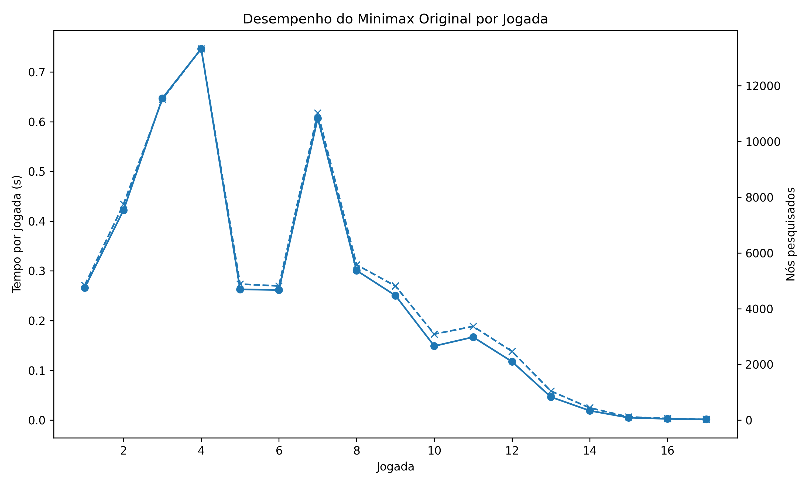
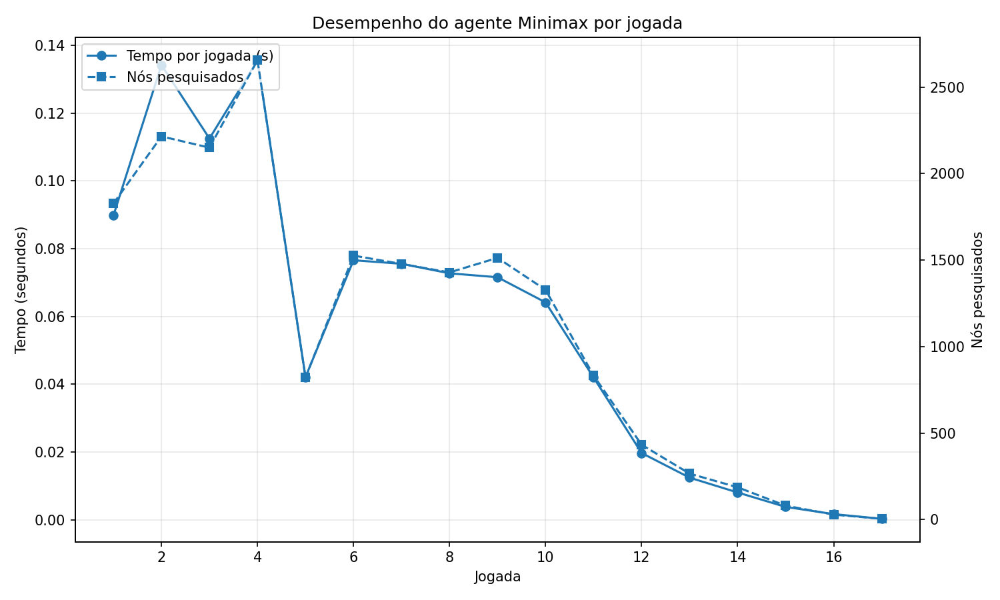
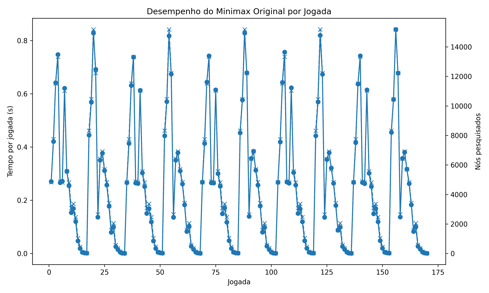
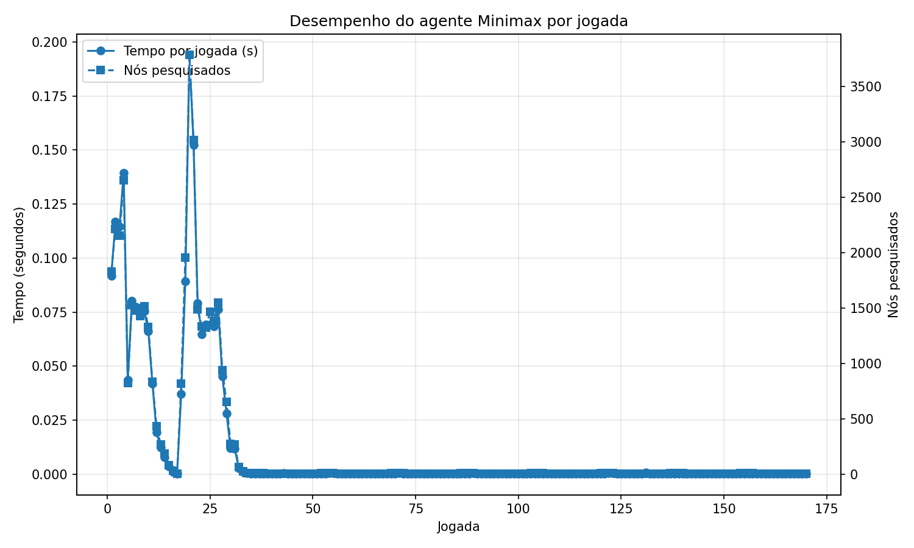

#  SI2 - Connect Four

## Estratégia do Agente

Numa fase inicial, foi adotada uma estratégia baseada no algoritmo **Minimax com Alpha-Beta Pruning**. Esta abordagem já permitia ao agente tomar decisões competitivas e vencer partidas contra jogadores humanos em modo manual.

O algoritmo Minimax simula possíveis jogadas futuras, alternando entre dois tipos de decisão: maximizar a vantagem do nosso agente e minimizar a vantagem do adversário. Assim, o agente tenta escolher a jogada que conduz ao melhor resultado possível, assumindo que o adversário também joga da forma mais racional possível.

Para melhorar o desempenho do Minimax, foi aplicado **Alpha-Beta Pruning**. Esta técnica permite cortar ramos da árvore de pesquisa que já não têm potencial para alterar a decisão final. Ou seja, quando o algoritmo percebe que uma determinada sequência de jogadas não será melhor do que outra já analisada, deixa de explorar esse caminho. Isto reduz significativamente o número de estados analisados, mantendo a mesma decisão que seria obtida com o Minimax completo.

Para que o algoritmo Minimax consiga escolher uma jogada quando ainda não chegou a um estado terminal, foi definida uma **função heurística de avaliação**. Esta função atribui uma pontuação ao estado atual do tabuleiro, indicando se a posição é mais favorável para o nosso agente ou para o adversário.

A heurística analisa o tabuleiro através de janelas de quatro posições, uma vez que o objetivo do Connect Four é formar uma sequência de quatro peças consecutivas. Estas janelas são avaliadas em todas as direções possíveis: horizontal, vertical, diagonal descendente e diagonal ascendente.
Para cada janela de quatro posições, é atribuída uma pontuação de acordo com o número de peças do agente, peças do adversário e espaços vazios.

A lógica usada foi a seguinte:

```python
if me == 4:
    return 100
if me == 3 and empty == 1:
    return 5
if me == 2 and empty == 2:
    return 2
if opp == 4:
    return -150
if opp == 3 and empty == 1:
    return -4
return 0
```
Inicialmente, o agente utilizava uma profundidade inferior, mas posteriormente aumentámos a profundidade de pesquisa para **6**. Este aumento permitiu ao agente antecipar melhor as jogadas futuras e tomar decisões mais estratégicas. No entanto, também fez crescer bastante o número de nós pesquisados, aumentando o tempo necessário para escolher cada jogada. Por esse motivo, tornou-se necessário introduzir técnicas de otimização.

## Otimização com Transposition Table e Zobrist Hashing

Para otimizar a pesquisa, foi implementada uma **Transposition Table** em conjunto com **Zobrist Hashing**.

A **Transposition Table** funciona como uma memória/cache de estados já analisados. Durante a pesquisa, é possível chegar ao mesmo estado do tabuleiro através de diferentes ordens de jogadas. Sem esta tabela, o agente poderia voltar a avaliar repetidamente posições que já tinham sido calculadas anteriormente. Com a Transposition Table, quando o agente encontra um estado já analisado, pode reutilizar o valor guardado, reduzindo o número de cálculos necessários.

Para identificar rapidamente cada estado do tabuleiro, foi utilizado **Zobrist Hashing**. Esta técnica atribui números aleatórios de 64 bits a cada combinação possível entre posição do tabuleiro e jogador. No caso do Connect Four, isto significa gerar valores para cada linha, coluna e jogador possível. O hash de um tabuleiro é calculado combinando, através da operação XOR, os valores correspondentes às peças atualmente presentes no tabuleiro.

A principal vantagem desta abordagem é que o hash pode ser atualizado de forma incremental. Quando uma peça é colocada numa coluna, não é necessário recalcular o hash do tabuleiro inteiro; basta aplicar XOR com o valor associado à nova peça colocada. Isto torna a identificação dos estados muito mais eficiente.

De forma simplificada, a lógica usada foi a seguinte:

1. Criar uma tabela Zobrist com valores aleatórios para cada posição e jogador.
2. Calcular o hash inicial do tabuleiro atual.
3. Sempre que uma jogada é simulada, atualizar o hash com XOR.
4. Antes de analisar um estado no Minimax, verificar se o seu hash já existe na Transposition Table.
5. Se existir uma entrada válida, reutilizar o valor armazenado.
6. Caso contrário, avaliar normalmente o estado e guardar o resultado na tabela.

Cada entrada da Transposition Table guarda informação como:

- profundidade a que o estado foi analisado;
- valor da avaliação;
- tipo de valor armazenado;
- melhor coluna encontrada para esse estado.

A profundidade é importante porque um estado analisado com maior profundidade contém mais informação estratégica do que um estado analisado superficialmente. Por isso, apenas são reutilizadas entradas calculadas com profundidade igual ou superior à profundidade atualmente necessária.

Também foram utilizadas flags para indicar o tipo de valor guardado:

- `EXACT`: o valor guardado corresponde à avaliação exata do estado;
- `LOWERBOUND`: o valor representa um limite inferior;
- `UPPERBOUND`: o valor representa um limite superior.

Estas flags são úteis porque, devido ao Alpha-Beta Pruning, nem sempre o valor obtido para um estado é exato. Em alguns casos, o algoritmo apenas sabe que o valor é pelo menos ou no máximo determinado valor.

Para avaliar o impacto das otimizações, foram recolhidas métricas durante a execução do agente. 

## Métricas

Performance durante um jogo completo com Transposition Table vazia.

<table width="100%">
  <tr>
    <td width="50%" style="padding-right: 10px;" valign="top">
      
      <p align="center"><em>Minimax Alpha Beta</em></p>
    </td>
    <td width="50%" style="padding-left: 10px;" valign="top">
      
      <p align="center"><em>Minimax TT Zobrist</em></p>
    </td>
  </tr>
</table>

Performance durante 10 jogos semelhantes.

<table width="100%">
  <tr>
    <td width="50%" style="padding-right: 10px;" valign="top">
      
      <p align="center"><em>Minimax Alpha Beta</em></p>
    </td>
    <td width="50%" style="padding-left: 10px;" valign="top">
      
      <p align="center"><em>Minimax TT Zobrist</em></p>
    </td>
  </tr>
</table>

Verifica-se que ao preencher a Transposition Table as jogadas ideais não necessitam de ser recalculadas. 

## Configuração

A “simulação” é iniciada utilizando o Docker Compose, que arranca o servidor backend e o visualizador frontend.

1. **Iniciar o ambiente**:
    ```bash
    docker compose up
    ```
    O visualizador frontend fica disponível em `http://localhost:8080`.

2. **Executar os Agentes**:
    Crie um ambiente virtual e instale as dependências:
    ```bash
    python3 -m venv venv
    source venv/bin/activate
    pip install -r requirements.txt
    ```

    Execute os agentes localmente:
    ```bash
    python agents/dummy_agent.py
    ```
    ou
    ```bash
    python agents/manual_agent.py
    ```
    ou
    ```bash
    python agents/minimax_agent_tt_zobrist.py
    ```

## Estrutura do Projeto

- `backend/`: contém o código Python do lado do servidor (`server.py`) e o respetivo `Dockerfile`. O servidor gere o estado do jogo, as pontuações e a comunicação.
- `frontend/`: contém o visualizador (HTML, JS, CSS) para monitorizar o estado do jogo.
- `agents/`: contém os agentes do Connect Four:
    - `base_agent.py`: a classe base abstrata para os agentes.
    - `dummy_agent.py`: um agente automatizado simples que faz jogadas aleatórias.
    - `minimax_agent_tt_zobrist.py`: um agente que utiliza minimax com alpha-beta pruning e otimizações com Tabela de Transposição e Zobrist Hashing.
    - `manual_agent.py`: um agente que permite interação manual do jogador através do terminal.
- `compose.yml`: configuração do Docker Compose para executar o backend e o frontend.

## Autores
Alunos:
* **Alexandra Alves** - 112998
* **Rodrigo Bio** - 113977

Baseado no código desenvolvido por:
* **Mário Antunes** - [mariolpantunes](https://github.com/mariolpantunes)

## License

This project is licensed under the MIT License - see the [LICENSE](LICENSE) file for details.
